# Explainer

The explainer video, a frame per beat. It is silent and carries its script on
screen, so these stills are the whole of it: nobody reviews a video in a pull
request, they look at frames.

Everything shown as AWL-LD output is real output from this repository, produced
by the pipeline rather than mocked up.

<button class="awl-shot__prev" type="button" aria-label="Previous beat">Previous</button>

<button class="awl-shot__next" type="button" aria-label="Next beat">Next</button>

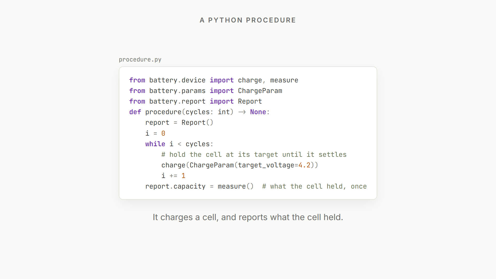
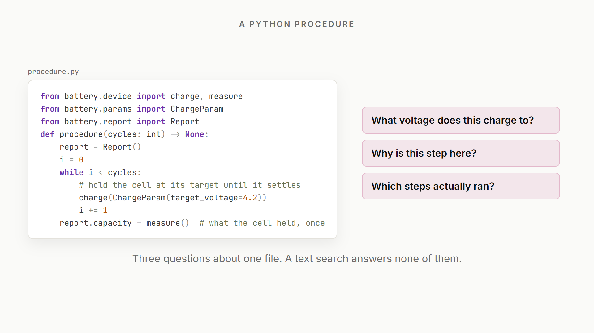
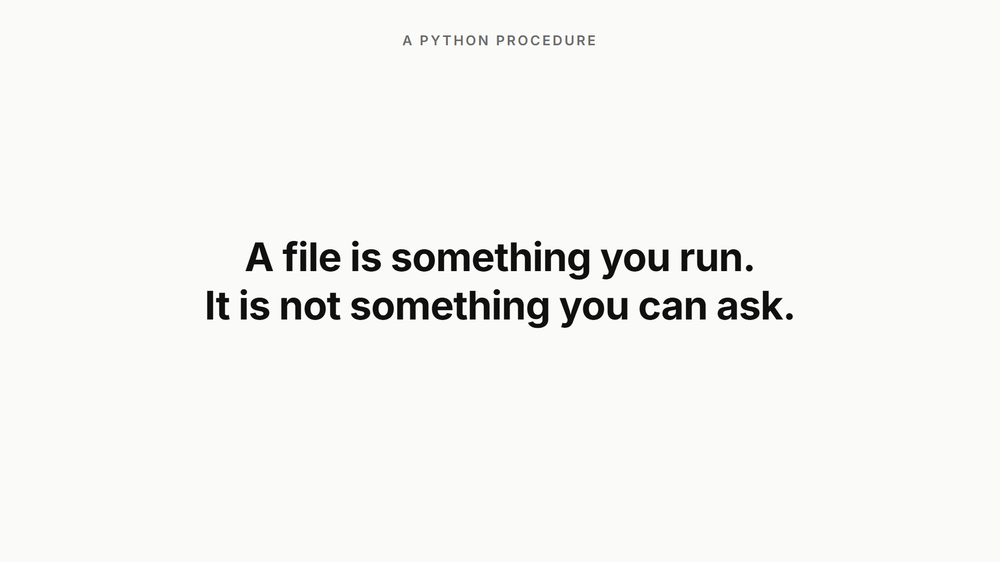
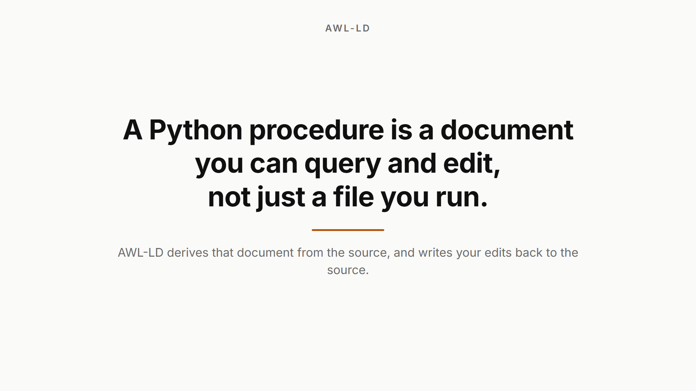
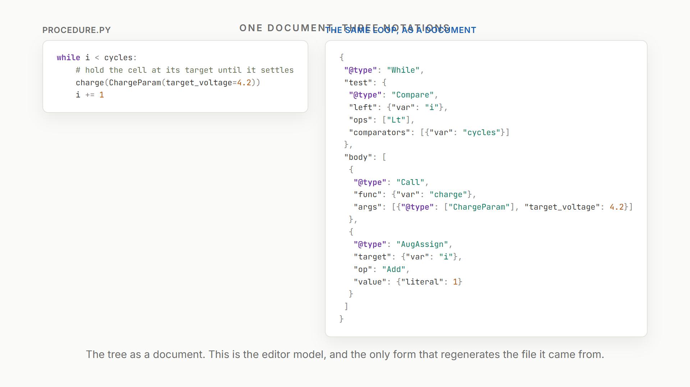
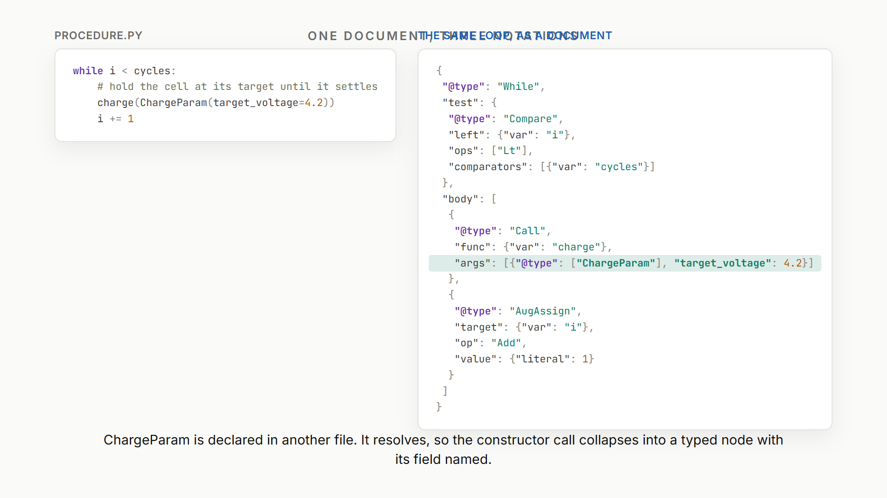
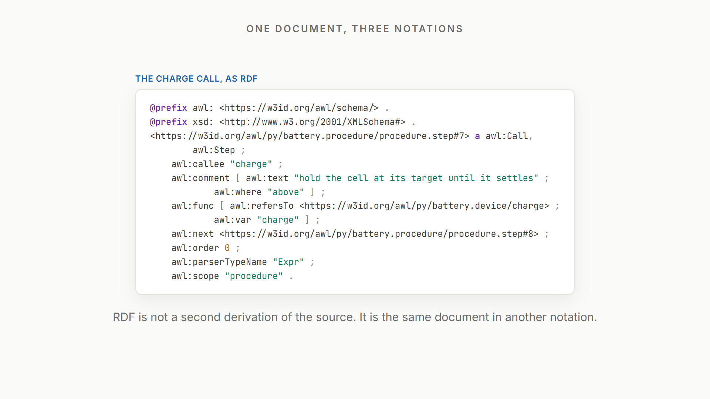
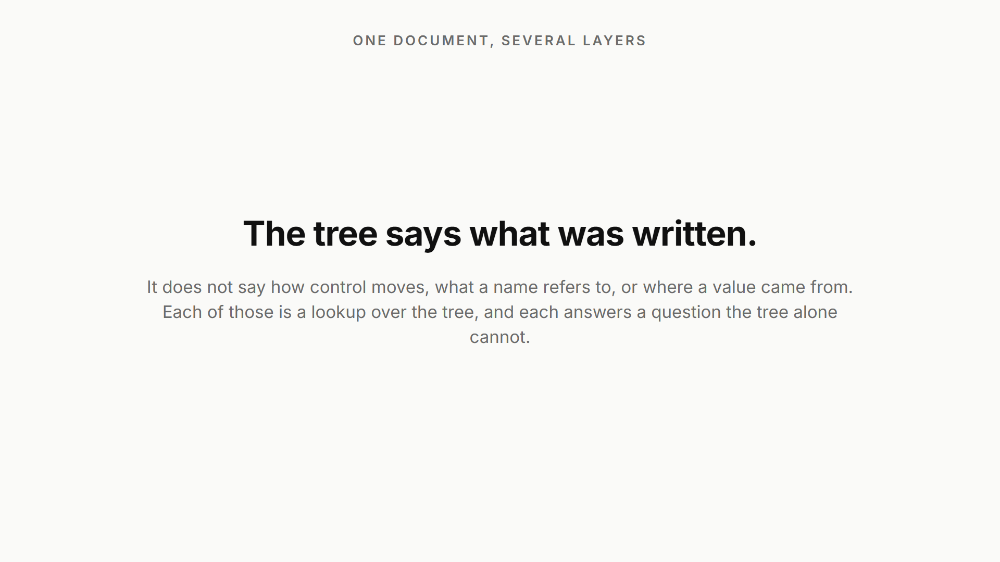
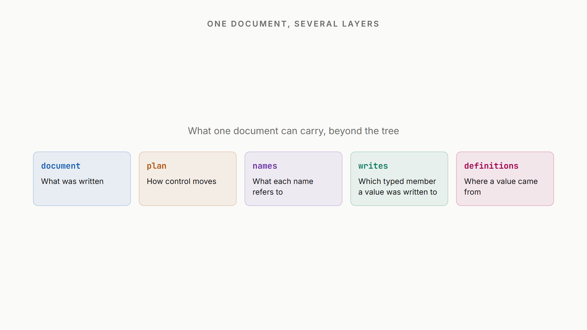
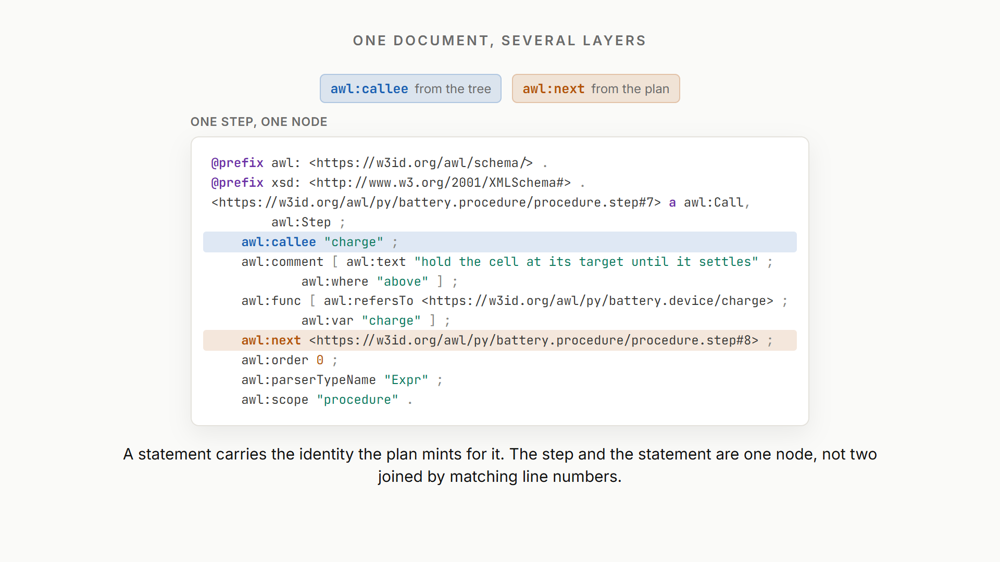
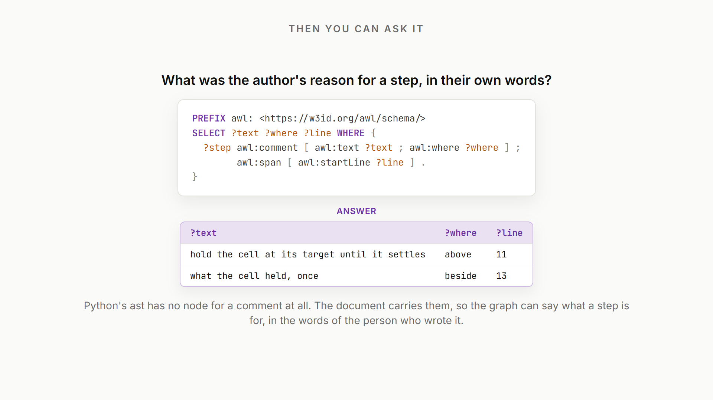
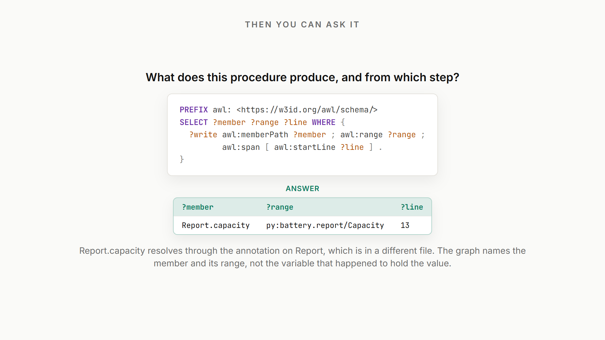
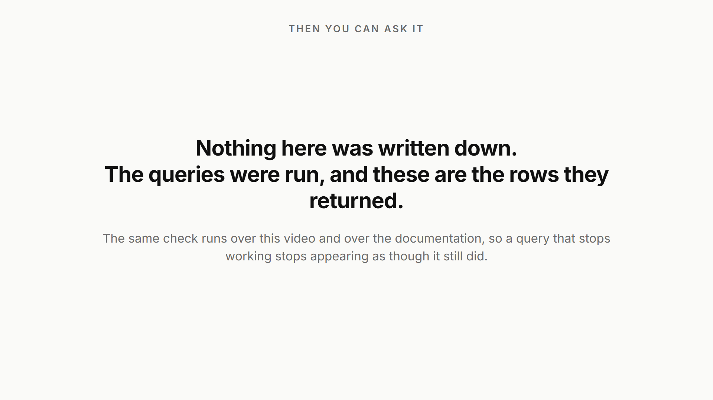
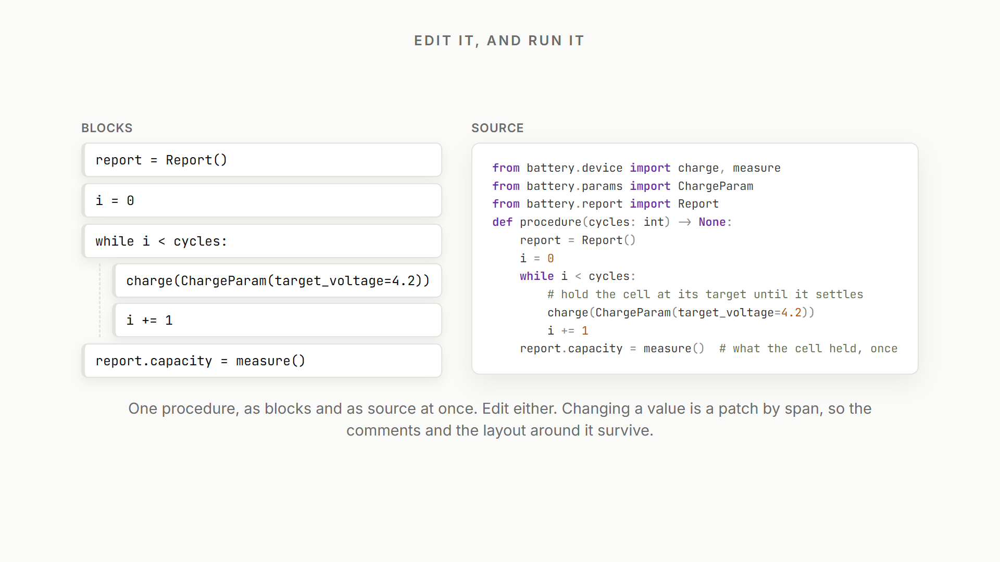
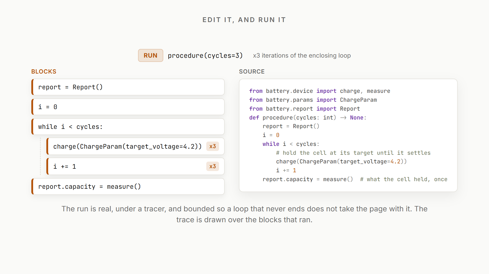
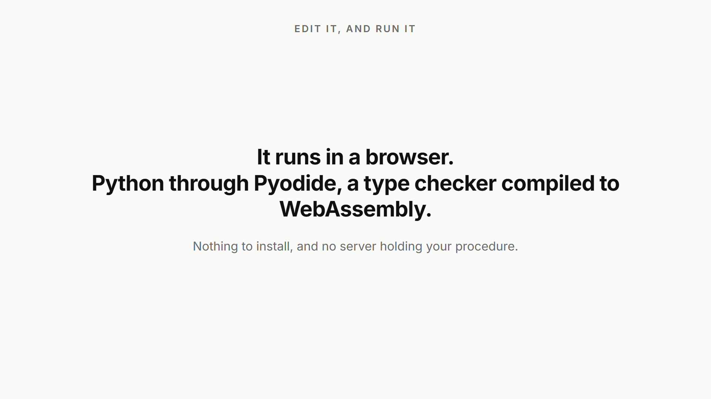
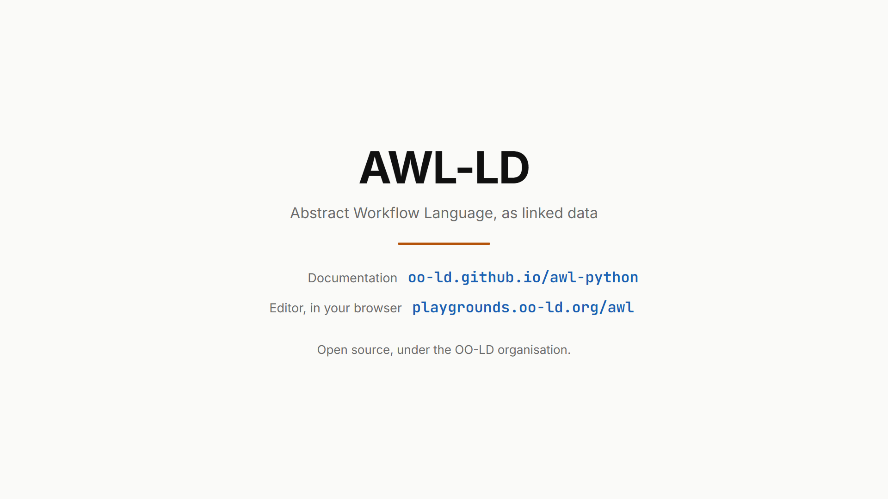

Left and right step through the beats. The frame numbers come from
`media/explainer/scripts/stills.mjs`, so retiming a scene moves these with it;
rebuild them with `npm run stills` in that directory.
